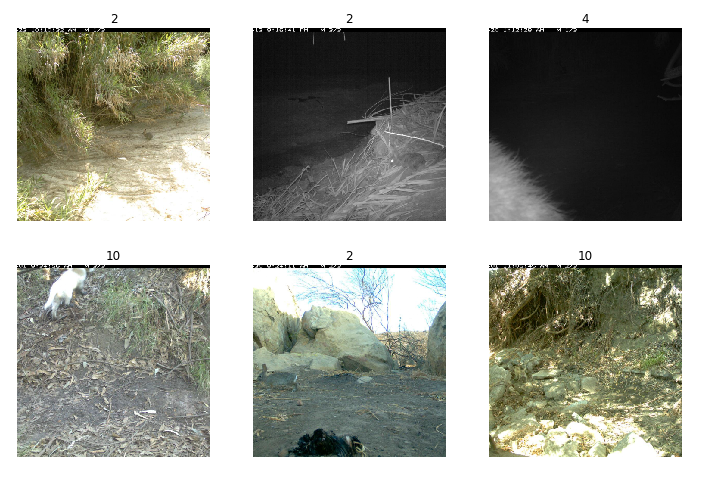
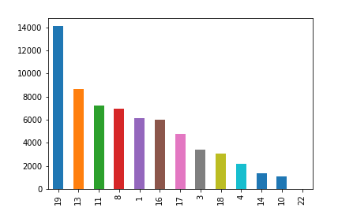
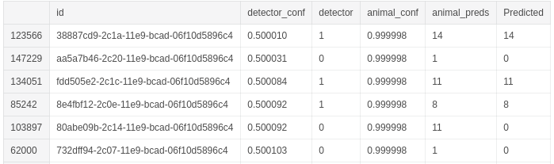

# IWILD-2019

I used fastai as it is an awesome library that allows for fast prototyping with built in best practices that you don't have to think about like learning rate their learning rate scheduler and their data api also saves a lot of time not having to write a  data loader from scratch , split data in train and validation. This allows you to focus on improving the model(working on the fun stuff). Also fastai V3 Part2 is coming out next month so I wanted to get comfortable with the library before tackling that course.

iWildCam 2019 - FGVC6 - "how do you classify a species in a new region that you may not have seen in previous training data?". In essence the challenge asked you to identify different species of animals from trail cam images.

As you can see from the above images there were a range of challenges including small regions of interest (top left), images taken at night(top middle) and perspective (top right) to name just a few.

Another issue was the huge class imbalances present in the data set.Plotting the samples per class after removing the empty class which had 131,457 samples, over 67% of the training data. The mountain lion (22) had this fewest with 33 training examples.

My initial thought was I needed to train on large images if my model had any chance of detecting the smaller animals. So probably going to start off with a smaller network like resnet34 the will work with my GPU restrictions.

The first approach was to remove all the empty class images, train a model on only images containing animal then use the class probabilities and some threshold. eg: If the model didn't predict a class with a confidence of at least 0.4 the i would set the class to empty. This approach didn't work well with  a public LB score of 0.108. It was hard to find a threshold that worked well. Although i could have tried some other approaches to find a good threshold(run inference on the entire train set and test various how thresholds performed) i decided to try a second approach.

My second approach involved creating binary classifier, which would just predict if an animal was in an image. I then combined the results from these two models, if the animal detector model detects an animal I use the images class prediction as its final prediction other wise it will just be predicted as empty. This got me a public LB score of 0.156 and shot me up to 17th  place.

Looking at the class probabilities I could see that there was still room for improvement.

Some predictions from the animal detector where right on the threshold, predicting no animal was in image with 0.5001 confidence while the animal classifier was predicting a elk with a 0.999 confidence(see above last second row). After finding a few more of these examples and checking the images I knew that this was the best approach. I could try another threshold approach but thought a small Neural Net might be a fun solutions.